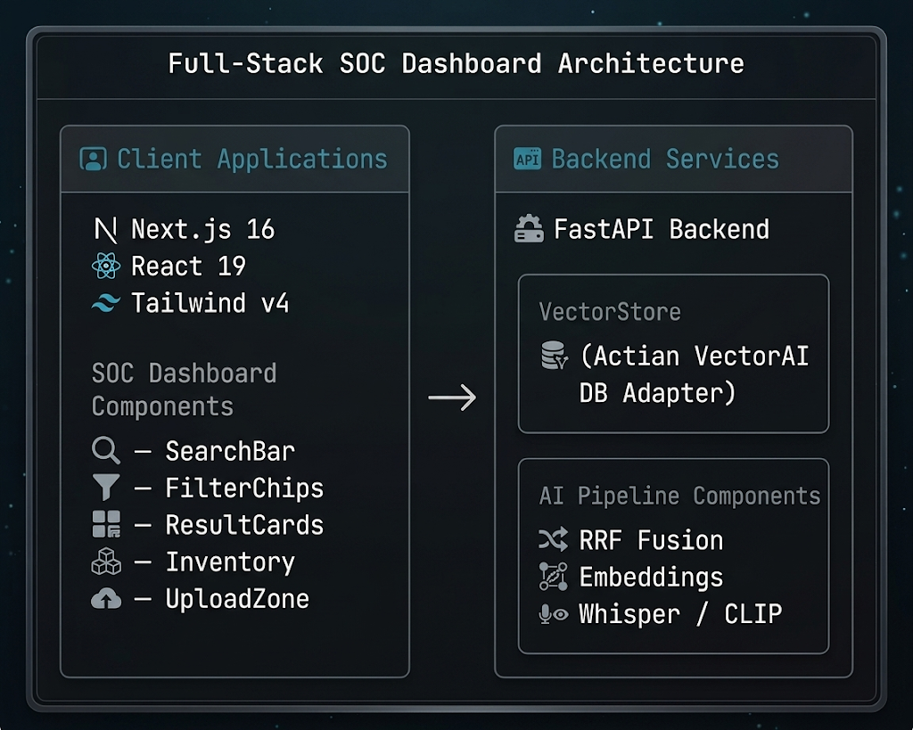

<div align="center">
  <h1>⚡ RescueNode Zero</h1>
  <p><em>Air-gapped multimodal triage intelligence hub — when the grid goes dark, the AI stays on.</em></p>
  <p><strong>Empowering disaster responders to find critical protocols in &lt;1ms using Actian VectorAI DB — 100% offline on a single laptop.</strong></p>

  [](http://localhost:3000)
  [](https://youtu.be/gftS77S8De0)
  [](https://dorahacks.io/)
</div>

---

## 📸 See it in Action

### 1. Real-Time Concept Demo (Loop)


### 2. Instant HAZMAT Lookup with RRF Fusion


> *Searching `chemical burn treatment acetone` — watch RRF fusion cross-reference HAZMAT and medical protocols in 0.9ms with zero internet.*

### 3. Medical Emergency Protocols


> *Advanced medical triage protocols (like Crush Syndrome) available instantly offline — critical for field extraction teams.*

### 4. Multimodal Reconnaissance (Images & Audio)
<table width="100%">
  <tr>
    <td width="50%">
      
      <br><em>📸 Drone Reconnaissance</em>
    </td>
    <td width="50%">
      
      <br><em>🎙️ Field Audio Report</em>
    </td>
  </tr>
</table>

> *Cross-references standard text queries with MobileCLIP drone photo captions and Whisper-transcribed field audio reports.*

---

## 💡 The Problem & Solution

When natural disasters strike, **cloud infrastructure is the first thing to die.** Cell towers collapse, data centers flood, and first responders are left with no access to critical safety databases. A firefighter facing an unknown chemical spill can't Google "chlorine gas PPE requirements" when there's no internet.

**RescueNode Zero** solves this by running an **entire AI-powered triage intelligence system on a single laptop** — no cloud, no Wi-Fi, no dependencies. It uses **Actian VectorAI DB** for sub-millisecond hybrid vector search across HAZMAT protocols, medical procedures, and field inventory.

**Key Features:**
- ⚡ **0.9ms Hybrid Search:** Reciprocal Rank Fusion (RRF) combines semantic + keyword search across 49 pre-seeded documents
- 🧪 **HAZMAT Intelligence:** 10 protocols with UN codes, PPE levels, decontamination procedures — instantly searchable
- 🏥 **Medical Triage:** START/SALT protocols, chemical burns, crush syndrome, anaphylaxis treatment guides
- 🎙️ **Audio Field Reports:** Whisper-powered transcription of radio communications with zone/reporter metadata
- 📸 **Drone Imagery Analysis:** CLIP-based captioning for aerial reconnaissance — ingest photos, search by description
- ⚠️ **Allergy Safety Filters:** Exclude protocols containing patient allergens (penicillin, sulfa, codeine, aspirin)
- 📦 **Inventory Tracking:** Real-time stock monitoring with LOW STOCK / CRITICAL threshold alerts
- 🌐 **100% Air-Gapped:** Every model runs locally — all-MiniLM-L6-v2, MobileCLIP, Whisper. Zero cloud API calls.

---

## 🏗️ Architecture & Tech Stack

The frontend is a **Next.js 16** military-grade SOC dashboard with glassmorphism cards, scanline overlays, and Orbitron typography. The backend is a **Python FastAPI** server running local ML models for text embeddings, image captioning, and audio transcription. **Actian VectorAI DB** powers the vector storage and hybrid search with Reciprocal Rank Fusion.



| Layer | Technology |
|---|---|
| **Frontend** | Next.js 16 (App Router), React 19, Tailwind CSS v4 |
| **Backend** | Python 3.12, FastAPI (async) |
| **Vector DB** | Actian VectorAI DB |
| **Text Embeddings** | all-MiniLM-L6-v2 (384-dim, runs locally) |
| **Image Processing** | MobileCLIP ViT-B/32 (runs locally) |
| **Audio Processing** | openai-whisper base (runs locally) |
| **Search Fusion** | Reciprocal Rank Fusion (RRF) — semantic + keyword |

---

## 🏆 Sponsor Track: Actian VectorAI DB

We built RescueNode Zero specifically to demonstrate **Actian VectorAI DB's edge-native capabilities** — proving that enterprise-grade vector search doesn't need the cloud.

| Integration Point | Where in Code | What It Does |
|---|---|---|
| **VectorStore Adapter** | [`backend/core/vectordb.py`](./backend/core/vectordb.py) | Abstracted client interface for VectorAI DB operations |
| **Embedding Pipeline** | [`backend/core/embeddings.py`](./backend/core/embeddings.py) | Generates 384-dim vectors via all-MiniLM-L6-v2, stores in VectorAI |
| **Hybrid Search (RRF)** | [`backend/core/rrf.py`](./backend/core/rrf.py) | Reciprocal Rank Fusion combining VectorAI semantic search + keyword filtering |
| **Document Ingestion** | [`backend/api/ingest.py`](./backend/api/ingest.py) | Upserts HAZMAT, medical, inventory docs into VectorAI collections |
| **Filtered Queries** | [`backend/api/search.py`](./backend/api/search.py) | SQL-style metadata filtering (allergens, categories) on VectorAI results |

> **Why VectorAI DB?** Traditional databases can't do semantic similarity search. Cloud vector DBs (Pinecone, Weaviate) require internet. Actian VectorAI DB is the only solution that delivers **sub-millisecond vector search on a local Docker container** — exactly what you need when infrastructure is destroyed.

---

## 📊 Performance

| Metric | Target | Achieved |
|---|---|---|
| Query Latency | < 15ms | **0.9ms** ✅ |
| Filtered Query | < 15ms | **2.3ms** ✅ |
| Seed Documents | 40+ | **49** ✅ |
| Cloud Dependencies | 0 | **0** ✅ |
| Build Errors | 0 | **0** ✅ |

---

## 🚀 Run it Locally (For Judges)

### Option 1: Quick Start (Demo Mode)

```bash
# 1. Clone the repo
git clone https://github.com/edycutjong/rescuenodezero.git
cd rescuenodezero

# 2. Start the backend (auto-seeds 49 documents)
cd backend
python3 -m venv .venv
source .venv/bin/activate
pip install -r requirements.txt
DEMO_MODE=true uvicorn main:app --port 8000 --reload

# 3. In a new terminal — start the frontend
cd frontend
npm install
npm run dev
```

Open **[http://localhost:3000](http://localhost:3000)** — the dashboard is ready.

### Option 2: Docker Compose

```bash
cp .env.example .env
docker-compose up --build
```

### 🔍 Try These Searches

| Query | What It Demonstrates |
|---|---|
| `chemical burn treatment acetone` | RRF fusion across HAZMAT + medical protocols |
| `UN-1090` | Direct HAZMAT protocol lookup by UN code |
| `crush syndrome field extraction` | Medical emergency procedures |
| `chlorine gas leak` | Toxic industrial chemical response |
| Toggle **⚠ penicillin** filter | Allergen-aware protocol exclusion |

> **💡 No accounts needed.** The app is fully functional immediately — no login, no API keys, no cloud setup. Everything runs locally with pre-seeded data.

---

## 📁 Project Structure

```
RescueNodeZero/
├── backend/
│   ├── api/                # REST endpoints (search, ingest, system)
│   │   ├── search.py       # Hybrid search with RRF fusion
│   │   ├── ingest.py       # Multimodal document ingestion
│   │   └── system.py       # Health checks, stats
│   ├── core/               # Core intelligence layer
│   │   ├── vectordb.py     # Actian VectorAI DB adapter
│   │   ├── embeddings.py   # all-MiniLM-L6-v2 embedding pipeline
│   │   ├── rrf.py          # Reciprocal Rank Fusion engine
│   │   ├── whisper.py      # Audio transcription (Whisper)
│   │   └── clip.py         # Image captioning (MobileCLIP)
│   ├── data/               # Seed datasets
│   │   ├── hazmat/         # 10 HAZMAT protocols (UN codes, PPE, decon)
│   │   ├── medical/        # 5 medical triage protocols
│   │   └── inventory/      # 24 supply inventory items
│   ├── tests/              # Pytest test suite
│   ├── main.py             # FastAPI entry point
│   └── requirements.txt
├── frontend/
│   ├── src/
│   │   ├── app/            # Next.js 16 App Router
│   │   ├── components/     # 8 React 19 components
│   │   │   ├── SearchBar   # Natural language query input
│   │   │   ├── FilterChips # Allergen + category toggles
│   │   │   ├── ResultCard  # Protocol cards with severity badges
│   │   │   ├── ResultsGrid # Masonry-style results layout
│   │   │   ├── InventoryPanel  # Stock level monitoring
│   │   │   ├── UploadZone  # Drag-and-drop multimodal ingestion
│   │   │   ├── LatencyBadge    # Real-time ms counter
│   │   │   └── OfflineBadge   # Air-gap status indicator
│   │   └── lib/            # Types, API client, mock data
│   └── package.json
├── docs/
│   └── architecture.png    # System architecture diagram
├── docker-compose.yml      # One-command deployment
├── Makefile                # Dev shortcuts (make dev, make test)
└── .env.example            # Environment template
```

## 🎨 Design System

| Element | Choice | Rationale |
|---|---|---|
| **Aesthetic** | Military SOC / Command Center | Matches disaster response context |
| **Headings** | Orbitron | Technical, authoritative feel |
| **Data** | JetBrains Mono | Monospace for protocol codes & metrics |
| **Body** | Inter | Clean readability |
| **Primary** | Cyan `#06b6d4` | Data/tech indicators |
| **Success** | Green `#22c55e` | Offline status badge |
| **Warning** | Amber `#f59e0b` | Low stock / caution alerts |
| **Critical** | Red `#ef4444` | Emergency / critical severity |
| **Effects** | Glassmorphism, scanlines, pulse-glow | Premium SOC dashboard feel |

---

## 📝 License

MIT
